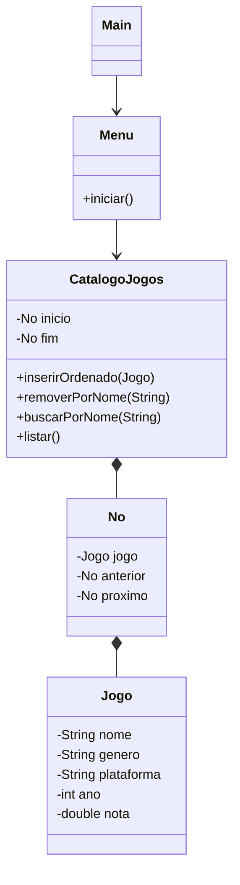

# GameChain — Catálogo de Jogos

Aplicação Java de terminal para cadastrar, buscar, remover e navegar por um catálogo de jogos. O projeto usa uma lista duplamente encadeada para armazenar os itens do catálogo.

## Funcionalidades

- Cadastrar jogos com nome, gênero, plataforma, ano e nota.
- Remover e buscar jogos pelo nome.
- Listar o catálogo e consultar seu status.
- Navegar para o próximo ou o jogo anterior.
- Inserir jogos de forma ordenada.

## Diagrama de classes



## Estrutura

```text
src/
├── CatalogoJogos.java # Operações da lista encadeada
├── Jogo.java          # Entidade do catálogo
├── Menu.java          # Menu interativo
├── No.java            # Nó da lista duplamente encadeada
└── Main.java          # Ponto de entrada
```

## Como executar

Com um JDK instalado:

```bash
javac -d out src/*.java
java -cp out Main
```

## Conceitos praticados

- Programação orientada a objetos.
- Lista duplamente encadeada.
- Inserção ordenada, busca e remoção.
- Entrada de dados e validação no terminal.
